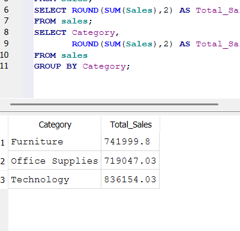
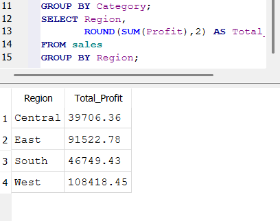
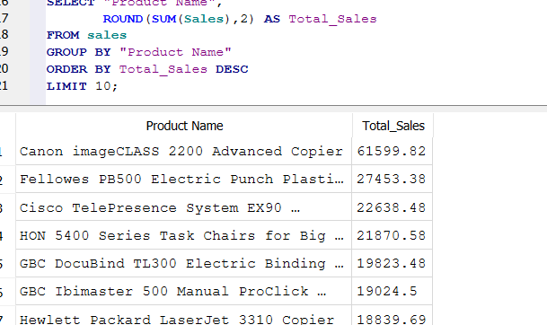

# ecommerce-sales-sql-analysis
SQL analysis of retail sales data using SQLite and DB Browser.
# E-Commerce Sales Analysis using SQL

## Project Overview

This project analyzes retail sales data using SQL and SQLite to identify sales trends, profitable regions, top-performing products, customer purchasing patterns, and shipping preferences.

The goal of this project is to demonstrate SQL querying skills and generate business insights from real-world sales data.

---

## Dataset

Sample Superstore Dataset

- Records: 9,994
- Columns: 21
- Industry: Retail / E-Commerce

---

## Tools Used

- SQLite
- DB Browser for SQLite
- SQL
- GitHub

---

## SQL Skills Demonstrated

- SELECT
- WHERE
- GROUP BY
- ORDER BY
- SUM()
- AVG()
- COUNT()
- LIMIT()

---

## Analysis Performed

### 1. Total Sales Analysis

Calculated overall company sales using aggregate functions.

### 2. Sales by Category

Compared sales performance across:

- Furniture
- Office Supplies
- Technology

### 3. Profit by Region

Analyzed profitability across:

- Central
- East
- South
- West

### 4. Top Selling Products

Identified the highest revenue-generating products.

### 5. Top States by Sales

Ranked states based on total sales.

### 6. Discount Analysis

Calculated average discount offered by category.

### 7. Shipping Analysis

Compared sales generated through different shipping methods.

---

## Key Findings

### Category Performance

| Category | Total Sales |
|-----------|------------|
| Technology | 836,154 |
| Furniture | 741,999 |
| Office Supplies | 719,047 |

Technology generated the highest revenue.

---

### Regional Profitability

| Region | Profit |
|----------|---------|
| West | 108,418 |
| East | 91,523 |
| South | 46,749 |
| Central | 39,706 |

West region produced the highest profit.

---

### Top Selling Product

Canon imageCLASS 2200 Advanced Copier

Sales: $61,599.82

---

### Top States by Sales

| State | Total Sales |
|----------|------------|
| California | 457,687 |
| New York | 310,876 |
| Texas | 170,188 |
| Washington | 138,641 |
| Pennsylvania | 116,512 |

California generated the highest sales.

---

### Average Discount by Category

| Category | Average Discount |
|------------|----------------|
| Furniture | 0.17 |
| Office Supplies | 0.16 |
| Technology | 0.13 |

Furniture received the highest average discount.

---

### Sales by Ship Mode

| Ship Mode | Total Sales |
|-------------|------------|
| Standard Class | 1,358,215 |
| Second Class | 459,194 |
| First Class | 351,428 |
| Same Day | 128,363 |

Standard Class generated the highest sales volume.

---

## Business Recommendations

- Focus marketing efforts on Technology products.
- Improve profitability in the Central region.
- Maintain inventory levels for top-selling products.
- Prioritize California and New York markets.
- Review discount strategies for Furniture products.
- Optimize shipping operations around Standard Class deliveries.

---
## Query Results

### Sales by Category

### Profit by Region

### Top Products

## Author

Sreemaan

Aspiring Data Analyst | Master's in Data Science (University of Western Australia)
